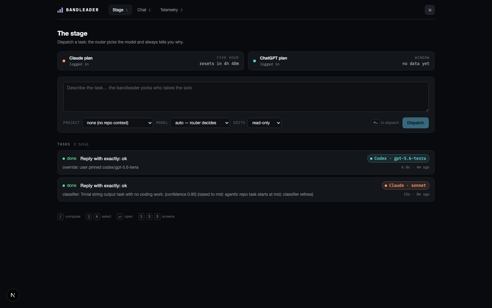

# bandleader

A local-first workbench for AI coding agents. The bandleader decides which model takes the solo. Each task gets dispatched to the right provider and model for its difficulty, on your existing subscription plans, with the routing decision always visible and always overridable.

## Architecture

Bandleader never calls provider APIs with subscription credentials. It orchestrates the official provider CLIs as subprocesses, on your own logged-in sessions.

```
task
  │
  ▼
router: decide(request) → tier + provider + model + reason
  0. user override      — an explicit model/provider/tier always wins
  1. hard rules in code — chat → cheap, planning keywords → frontier,
                          repo task → at least mid, prompt-size thresholds,
                          sticky failure memory
  2. cheap classifier   — Haiku via the Claude adapter, strict JSON rubric,
                          only for the ambiguous middle; unsure → mid
  │
  ▼
adapter layer: run(opts) → AsyncIterable<NormalizedEvent>
  ├─ claude adapter → spawns `claude -p` (Claude Code, your Claude plan login)
  └─ codex adapter  → spawns `codex exec` (Codex CLI, your ChatGPT plan login)
  │    rate limited? → fail over to the next provider in the same tier
  ▼
verifier: configured shell commands (typecheck/tests) for repo tasks
  fail → re-run the original prompt one tier up with the failure as a hint
         (max one hop, sticky, never downgraded mid-task)
```

This shape is deliberate. Anthropic only permits subscription usage through the official Claude Code binary, so bandleader spawns `claude` as a subprocess and parses its stream. It never extracts OAuth tokens and never talks to the Anthropic API with plan credentials. OpenAI explicitly endorses running Codex on a ChatGPT plan login from third-party harnesses, and the `codex` CLI is used the same way for symmetry. Both adapters normalize their provider's stream into one shared event format.

## Status

S3: adapters, router, and the workbench UI. Two working adapters (Claude, Codex), the difficulty-routing pipeline, a tier map config, a JSONL decision log, and a local web app on top.

## The workbench



`npm run dev` and open http://localhost:3000. Four screens:

- **The stage** — task composer (project picker, model override, read-only/allow-edits), running and recent tasks as cards, and a quota strip showing each plan's window. Claude's CLI emits a plan-window heartbeat every run (reset time included); Codex has no equivalent, so its card says so instead of pretending.
- **Task detail** — live streaming transcript (tool calls collapsed, prose prominent), a timeline rail (routed → running → verified/escalated → done), and the escalation history when a task moved.
- **Chat lane** — quick questions through the same pipeline (`kind: chat`, verification skipped by design). Each message routes independently; there is no session threading in v1.
- **Telemetry** — the decision log as a table, per-provider status, and a misroute-review flag per routing (flags live in `data/misroutes.json`).

The transparency invariant holds everywhere: every task and chat answer shows the model badge plus the one-line routing reason, and an override (pin a model or a tier) is one click away — on the composer, and as "re-run on…" from any task.

Keyboard: `/` focuses the composer, `j`/`k` move through tasks, `↵` opens, `1`/`2`/`3` switch screens, `⌘↵` dispatches. Dark and light themes, both complete; the toggle is in the top bar.

Task history survives restarts: task records and their event streams append to JSONL under `data/` (gitignored). A task that was mid-run when the server died is marked failed with "interrupted by a server restart" instead of spinning forever.

All design tokens live in [`src/app/tokens.css`](src/app/tokens.css) (foundation copied from the watch-pr family's `app.css`). Markup uses semantic classes only, so a re-skin edits that one file without rewiring components.

## Routing

The tier map lives in [`bandleader.config.ts`](bandleader.config.ts) and is meant to be edited. v1 is plans-only — every model rides an existing subscription, and metered models are rejected at config load:

| Tier | First choice | Failover |
| --- | --- | --- |
| cheap | Claude Haiku | Codex `gpt-5.6-terra` |
| mid | Claude Sonnet | Codex `gpt-5.6-terra` |
| frontier | Claude Opus | Codex `gpt-5.6-terra` |

GPT-5.6 Sol is not in the map because it is not addressable on a ChatGPT plan login (`codex exec --model gpt-5.6-sol` is rejected server-side), so the frontier fallback is Codex's plan default.

Routing is always transparent: every result carries the chosen model and a one-line reason saying which layer decided and why. Overrides are absolute — a pinned model is never failed over, escalated, or otherwise second-guessed.

Every routing decision appends one JSON line to `data/decisions.jsonl` (gitignored): layers consulted, classifier verdict, failovers, escalations, and the outcome. That log is the raw material for reviewing misroutes before tuning the rubric.

## Setup

Requirements:

- Node 22
- [Claude Code](https://code.claude.com) installed and logged in with your Claude plan (`claude` on PATH)
- [Codex CLI](https://developers.openai.com/codex/cli) installed and logged in with your ChatGPT plan (`codex` on PATH, check with `codex login status`)

```bash
git clone https://github.com/micke-berg/bandleader.git
cd bandleader
npm install
```

Start the workbench:

```bash
npm run dev
```

Run the checks:

```bash
npm run lint
npm run typecheck
npm test
```

Smoke-test an adapter against your real login (uses a small amount of plan quota):

```bash
npm run smoke -- claude
npm run smoke -- codex
```

Smoke-test the router end to end (routes three tiny real tasks — a cheap chat, a classifier-refined task, and an explicit override — and prints the decision-log lines):

```bash
npm run smoke:router
```

No environment variables are needed. The adapters intentionally strip `ANTHROPIC_API_KEY` and `ANTHROPIC_AUTH_TOKEN` from the spawned environment so a stray API key can never be billed instead of the plan.

## Roadmap

- **S4, hardening**: QA sweep and baseline checklist

## License

MIT
